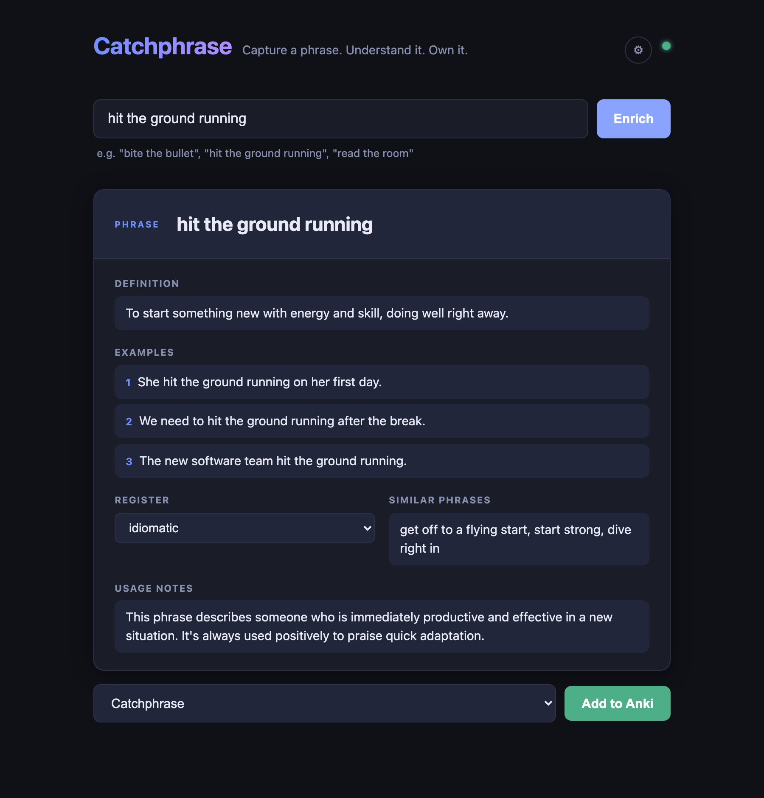

# Catchphrase

**The frictionless way to remember English phrases and idioms.**

You hear a great phrase — "*read the room*", "*hit the ground running*" — and you want to actually *use* it next time. So you reach for Anki. Then you remember: Anki is a spaced-repetition powerhouse, but its card-creation flow is brutal. Note types. Field templates. CSS for styling. Manual definitions. Sourcing example sentences. By the time you finish one card, the moment has passed.

**Catchphrase removes every step between *"that's a cool phrase"* and *"it's on my phone, ready to drill."***



## How it works

1. Type a phrase ("bite the bullet", "read the room"…)
2. **Enrich** — Gemini fills in a clean definition, 3 natural example sentences, register, usage notes, and similar phrases
3. Edit anything inline if you don't like the AI's take
4. **Add to Anki** — card lands in your `Catchphrase` deck and auto-syncs to AnkiWeb, ready on your phone in seconds

No note-type setup. No template editing. No copy-pasting from dictionaries. Just capture → enrich → send.

## Install

### Option 1 — Download (recommended)

Grab the latest release from the [Releases page](https://github.com/emelialei88/catchphrase/releases) and unzip:

- **macOS**: drag `Catchphrase.app` to `/Applications` → double-click to launch
- **Windows**: extract the zip → run `Catchphrase.exe`
- **Linux**: extract the tar.gz → run `./Catchphrase`

Your browser opens automatically to `http://localhost:7823`.

> First time on macOS, you may need to right-click → **Open** to bypass the Gatekeeper warning (the app isn't notarized yet).

### Option 2 — Run from source

```bash
pip install -r requirements.txt

./start.sh     # macOS / Linux
start.bat      # Windows
```

Open <http://localhost:7823>. On first run, you'll be prompted to:

1. Grab a free Gemini API key at <https://aistudio.google.com/app/apikey>
2. Paste it into Settings (key is stored in your browser's localStorage)
3. Make sure Anki is running with the AnkiConnect add-on installed

> Alternatively, set `GEMINI_API_KEY` in a `.env` file to skip the in-app prompt.

## Requirements

- **Anki desktop** installed. Catchphrase auto-launches it on macOS, Windows, and Linux when the backend starts (and exposes a "Launch Anki" button in the UI if it's ever closed).
- **AnkiConnect** add-on: in Anki → Tools → Add-ons → Get Add-ons → code `2055492159`
- **AnkiWeb account** configured in Anki preferences if you want phone sync

> The Anki app needs to be running because AnkiConnect lives inside Anki — but Catchphrase handles starting it for you. You can leave Anki minimized in the dock. For zero friction, add Anki to **System Settings → General → Login Items** so it's always running.

## Building binaries yourself

```bash
./build.sh
```

Produces `dist/Catchphrase.app` (macOS), `dist/Catchphrase.exe` (Windows), or `dist/Catchphrase` (Linux). Cross-platform release binaries are built automatically via GitHub Actions on every `v*` tag.

## Stack

- FastAPI backend (`main.py`) — `/api/enrich`, `/api/decks`, `/api/add-card`, `/api/anki-status`
- Vanilla JS frontend (`static/`) — no build step
- Gemini 2.5 Flash for enrichment (free tier: 250 req/day)
- AnkiConnect over `localhost:8765` for card injection

## Limits to know

- Anki desktop must be running (AnkiConnect lives inside the Anki process). Catchphrase auto-launches it on all major platforms.
- Gemini free tier sends your inputs to Google for training. Don't paste anything sensitive.
- Duplicate phrases in the same deck are rejected by AnkiConnect.
